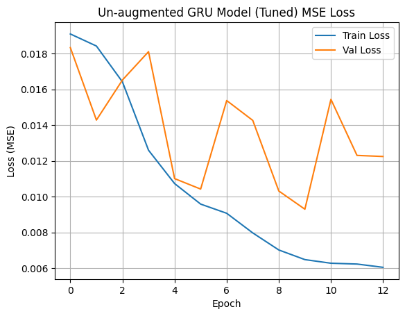
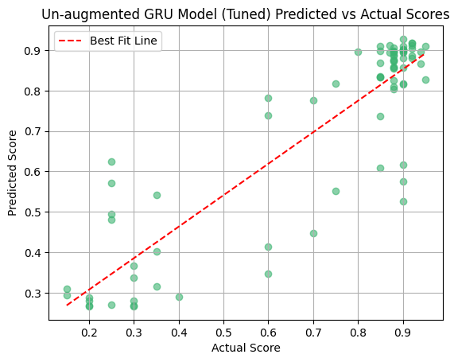

# ​ Sentiment Analysis RNN


**A Recurrent Neural Network (RNN)-based model for sentiment classification of texts (e.g., movie reviews, tweets).**  
*Processes sequential text data using word embeddings and an LSTM or SimpleRNN layer for binary sentiment prediction.*

---

## ​ Features

- 💬 **Text Preprocessing**: Tokenization, padding/truncating sequences to a fixed length.  
- 🆔 **Embedding Layer**: Converts words into dense vector representations.  
- 🔁 **RNN Architecture**: Utilizes SimpleRNN or LSTM for capturing temporal dependencies.  
- 🎯 **Binary Classification**: Outputs sentiment labels (positive vs. negative) via sigmoid activation.  
- 🏆 **Training & Evaluation**: Includes training with train/validation/test split and evaluation metrics (accuracy, loss).

---

## ​ Dataset

- **Sample Dataset**: Could be IMDb reviews or a custom dataset (e.g., tweets, product reviews).  
- **Preprocessing Steps**:
  - Text cleaning (lowercasing, removing punctuation)
  - Tokenization
  - Converting words to sequences
  - Padding to a standardized maximum length

---

## ​ Model Architecture

**RNN-based architecture** consisting of:

1. **Embedding Layer** (e.g., `Embedding(input_dim, output_dim, input_length=max_len)`)  
2. **Recurrent Layer**: SimpleRNN or LSTM with a specified number of units  
3. **Dense Output Layer** with `sigmoid` activation for binary sentiment output  
4. **Loss Function**: Binary Cross-Entropy  
5. **Optimizer**: Adam (or any gradient-based optimizer)

---

## ​​ Installation

```bash
# Clone the repository
git clone https://github.com/4ndrrw/Sentiment-Analysis-RNN.git
cd Sentiment-Analysis-RNN

# Create virtual environment
python -m venv venv
source venv/bin/activate  # Windows: venv\Scripts\activate

# Install dependencies
pip install -r requirements.txt
```

---

## 📊 Results

- **Mean Absolute Error (MAE)**:  8.15%
- **Mean Squared Error (MSE)**:   1.56%
- **R-squared (R² Score)**:       0.7874
- **Loss Curve**:  
    
- **Predicted vs. Actual Scores**:  
    

---

## ⚙️ Tech Stack


---

## 🤝 Contributing

1. Fork the repository.  
2. Create a new branch (`git checkout -b feature-branch`).  
3. Commit your changes (`git commit -am 'Add new feature'`).  
4. Push to the branch (`git push origin feature-branch`).  
5. Open a Pull Request.

---
